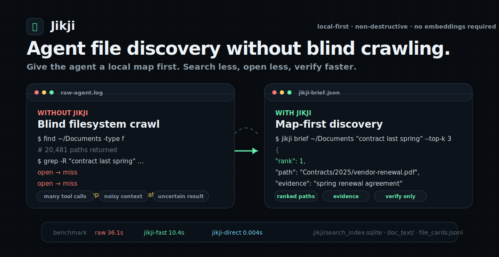

<h1 align="center">Jikji</h1>

<p align="center">
  <strong>Jikji find: local file discovery for AI agents</strong><br>
  <strong>파일 하나 찾을 때마다 38,650 토큰, 57초, 11.7회 LLM 호출을 쓰던 raw agent 탐색을 줄이는 비파괴 로컬 탐색 스킬</strong><br>
  <strong>같은 551건에서 Jikji find는 파일 하나당 447 토큰, 2.1초, 1회 호출로 더 높은 Hit@1을 냈다.</strong>
</p>

<p align="center">
  <a href="https://github.com/NomaDamas/jikji/blob/main/LICENSE"></a>
  
  
</p>

<p align="center">
  <a href="https://nomadamas.github.io/jikji/">
    
  </a>
</p>

<p align="center">
  <a href="https://nomadamas.github.io/jikji/"><strong>Live intro</strong></a> ·
  <a href="https://github.com/NomaDamas/jikji"><strong>GitHub</strong></a> ·
  <a href="docs/jikji-benchmarks.html"><strong>Benchmarks</strong></a> ·
  <a href="docs/agent-installation.md"><strong>Agent install guide</strong></a> ·
  <a href="skills/jikji/SKILL.md"><strong>Skill file</strong></a>
</p>

Public homepage: `https://nomadamas.github.io/jikji/`. It is a GitHub Pages
static site, so the public landing page is served through GitHub's CDN rather
than a local tunnel.

---

## What is Jikji?

Jikji prepares an explicit local folder so AI agents can find files, folders,
metadata, and parsed document text without repeatedly crawling the original
filesystem.

Jikji does not move, rename, delete, or reorganize user files. It creates
generated maps and caches under `.jikji/` plus `.jikji_agent_map.md`.

The public agent command is:

```bash
jikji find ROOT "natural language file clue" --json
```

`jikji find` builds a multi-query, multi-route candidate slate from metadata,
file maps, parser caches, graph routes, and local text indexes. The agent can
then use one bounded LLM judgment over the returned top-k slate instead of
spending many exploratory chat turns on `ls`, `find`, `grep`, document opening,
and query guessing.

## Why It Saves Calls And Gets More Accurate

Jikji is faster because the expensive discovery work is done before the agent is
asked to find a file:

- **No parse-at-search-time loop:** PDF, HWP/HWPX, Office, text, subtitles, HTML,
  archives, and opt-in media OCR/ASR are parsed into `.jikji/doc_text/` and
  metadata caches during `prepare`.
- **No repeated path wandering:** folder profiles, file cards, duplicate hints,
  route rows, and `.jikji_agent_map.md` turn a messy tree into an agent-readable
  file map.
- **Fielded local search:** path, filename, folder, extension, body text,
  metadata, and deterministic semantic terms are indexed separately, so obvious
  path clues and body-only clues both rank well.
- **LLM Wiki for agents:** each source gets a compact grounded wiki page, so the
  agent can inspect a short source summary instead of opening large raw files.
- **Knowledge graph routes:** source, folder, term, intent, and duplicate nodes
  are prebuilt into `.jikji/knowledge_graph.json` and `.jikji/graph_routes.jsonl`
  for low-token candidate routing.
- **Multi-route candidate slate:** `jikji find` generates query variants, gathers
  top-k candidates from metadata, file-map, wiki/cache, graph, and text routes,
  deduplicates by path, then returns one slate for bounded agent judgment.
- **Freshness without search-time prepare:** Jikji find checks a source-tree
  signature and reports when it is using the previous index. Refreshing is done
  through `jikji prepare` / `jikji refresh`, not by surprise work inside `find`.

This is **RAG-style retrieval context**, not a mandatory vector DB or cloud RAG
stack. Jikji's default index is local and deterministic: no embeddings, cloud
parser, or LLM call is required to prepare or search. The LLM is used only by the
agent when it needs to choose from the returned candidate slate.

## Quick Start

Tell your CLI agent this one sentence:

```text
GitHub 저장소 https://github.com/NomaDamas/jikji 에서 Jikji를 설치하고, 내 CLI 에이전트들이 `jikji find`를 바로 쓰도록 Jikji skill까지 연결해줘.
```

```bash
git clone https://github.com/nomadamas/jikji.git
cd jikji
python3 -m venv .venv
.venv/bin/pip install -e .

.venv/bin/jikji agent-skill-install --agent all --json
.venv/bin/jikji prepare ~/Documents --json
.venv/bin/jikji find ~/Documents "contract pdf from last spring" --json
```

Korean example:

```bash
jikji find ~/Documents "작년 봄 계약서 PDF" --json
```

`agent-skill-install` queues a low-impact post-install prepare for common user
material folders and document-heavy folders it can safely discover under the
user home directory. That initial prepare focuses on document extensions such as
PDF, HWP/HWPX, Word, Excel, PowerPoint, and RTF. `jikji find` itself does not
prepare unindexed roots; it searches only existing Jikji indexes. For setup and
diagnostics:

```bash
jikji prepare ROOT --json
jikji refresh ROOT --json
jikji doctor ROOT --json
jikji map ROOT
jikji clean ROOT --dry-run --json
```

## Why Agents Need It

Raw local agents typically do this:

```text
guess query -> list folders -> grep files -> open documents -> repeat
```

Jikji-equipped agents start here:

```text
jikji find ROOT "query" --json -> read answer_paths/candidates -> verify only top evidence
```

Use Jikji as the first action whenever an explicit root is available. Raw
filesystem search is a fallback only after the returned `handoff_action` allows
it.

## Measured Headline

HippoCamp Fullset, 551 local file-search cases, same Hermes task scope. The
table is the fullset total; the README headline above uses per-case averages.

```text
mode         cases  Hit@1   Hit@10  calls  input tokens  output tokens  total tokens  seconds    est. cost
raw Hermes     551  0.6697  0.7786  6,420  19,799,362    1,496,916      21,296,278    31,231.9   13,361원
Jikji find     551  0.7949  0.7949    551     228,684       17,632         246,316     1,164.2      156원
```

Per file-search case, raw Hermes averaged `11.7` LLM calls, `38,650` total
tokens, `56.7s`, and about `24원`; Jikji find averaged `1` call, `447` total
tokens, `2.1s`, and about `0.3원`.

Fullset result: Hit@1 improves from `0.6697` to `0.7949`, Hit@10 improves from
`0.7786` to `0.7949`, LLM calls drop `6,420 -> 551` (11.65x), wall time drops
`31,231.9s -> 1,164.2s` (26.83x), and total tokens drop
`21,296,278 -> 246,316` (86.46x). This is why the public product is now
`Jikji find`.

Other benchmark examples are shown in
[`docs/jikji-benchmarks.html`](docs/jikji-benchmarks.html), including media
OCR/ASR, Korean public-data XLSX, hard KOGL document sets, Workspace-Bench-Lite,
MIRACL-VISION, EDiTh, and BEIR diagnostics.

## Agent Protocol

Paste this behavior into Claude Code, Codex, Hermes, OpenCode/OpenClone-style
agents, or any CLI-capable local agent:

```text
Use Jikji for local file discovery when an explicit root is available.
First call: jikji find ROOT "query" --json.
Prefer answer_paths[] first. Preserve order when agent_should_not_rerank is true.
When handoff_action is direct_use, accept answer_paths[] / paths[] and avoid broad crawling.
When handoff_action is jikji_retry, run exactly one sharper Jikji find retry before raw fallback.
When handoff_action is raw_fallback_after_retry, raw search is allowed only after that retry failed, stayed empty, or stayed clearly wrong.
Inspect evidence_pack[].next_read, candidates[].next_read, or original files only for final verification.
Never move, rename, delete, or reorganize user files.
```

Install the reusable skill instruction:

```bash
jikji agent-skill-install --agent all --json
jikji hermes-skill-install --json
jikji codex-skill-install --json
jikji skill-export --dest /path/to/that-agent/skills/jikji/SKILL.md --json
```

## What Jikji Creates

```text
.jikji_agent_map.md         root guide for humans and agents
AGENTS.md / CLAUDE.md / .cursorrules  routing block pointing agents to `jikji find`
.jikji/search_index.sqlite  instant lexical/content/metadata search index
.jikji/doc_text/            parsed PDF/HWP/HWPX/Office/etc. text cache
.jikji/file_cards.jsonl     per-file cards, tags, parse status, evidence
.jikji/folder_profile.jsonl folder roles and navigation context
.jikji/agent_routes.md      safe fallback route for autonomous agents
.jikji/wiki/index.md        deterministic local LLM Wiki entry point
.jikji/wiki/sources/*.md    compact grounded Markdown page per source
.jikji/knowledge_graph.json source/folder/term/intent/duplicate graph
.jikji/graph_routes.jsonl   low-token route rows
```

Generated artifacts can be regenerated or removed with `jikji clean`. The routing
block in `AGENTS.md` / `CLAUDE.md` / `.cursorrules` is updated in place on each
prepare and can be skipped with `jikji prepare ROOT --no-agent-rules`; `jikji
clean` removes the block while preserving any user-authored content.

## Media Text

PDF, HWP/HWPX, Office, text, subtitles, HTML, JSON/YAML, and archives are indexed
within size and timeout limits. Image, audio, and video content OCR/ASR is opt-in
because it can use CPU/RAM:

```bash
pip install "jikji[media]"
jikji prepare ROOT --enable-media-index --media-index-max-mb 25 --parse-timeout 600
```

## Development

```bash
python3 -m venv .venv
.venv/bin/pip install -e .
.venv/bin/pip install pytest ruff
.venv/bin/ruff check src tests
.venv/bin/pytest -q
.venv/bin/python -m compileall -q src tests
```

## License

MIT License. See [LICENSE](LICENSE).
